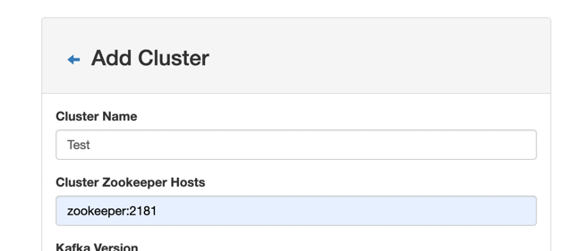
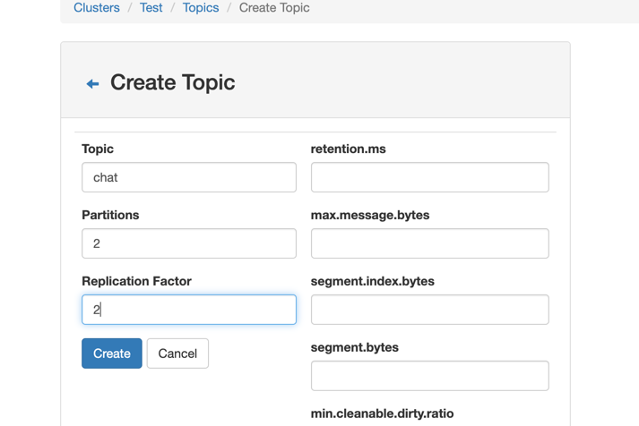

# Getting Started

### Reference Documentation

For further reference, please consider the following sections:

* [Official Apache Maven documentation](https://maven.apache.org/guides/index.html)
* [Spring Boot Maven Plugin Reference Guide](https://docs.spring.io/spring-boot/docs/2.7.5/maven-plugin/reference/html/)
* [Spring for Apache Kafka](https://docs.spring.io/spring-boot/docs/2.7.5/reference/htmlsingle/#messaging.kafka)
* [Spring Web](https://docs.spring.io/spring-boot/docs/2.7.5/reference/htmlsingle/#web)
* [Baeldung Spring Kafka](https://www.baeldung.com/spring-kafka)
* [Kafka Listeners - Explained](https://rmoff.net/2018/08/02/kafka-listeners-explained/)

### Guides

## Start various docker services

```cmd
docker-compose up -d
```

## Create a topic
Browse to `http://localhost:9000`

Add a cluster




Create `chat` topic




## Start Spring boot Application

```cmd
mvn spring-boot:run
```

## Stop and clean
Ctrl+C to stop mvn command

To clean docker service, Ctrl+C and run
```cmd
docker-compose down
```
